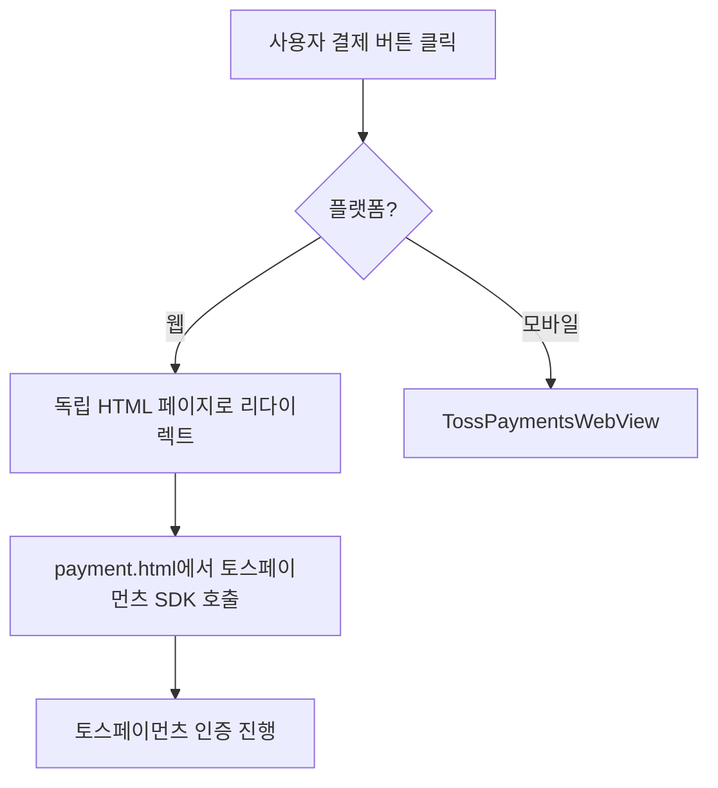
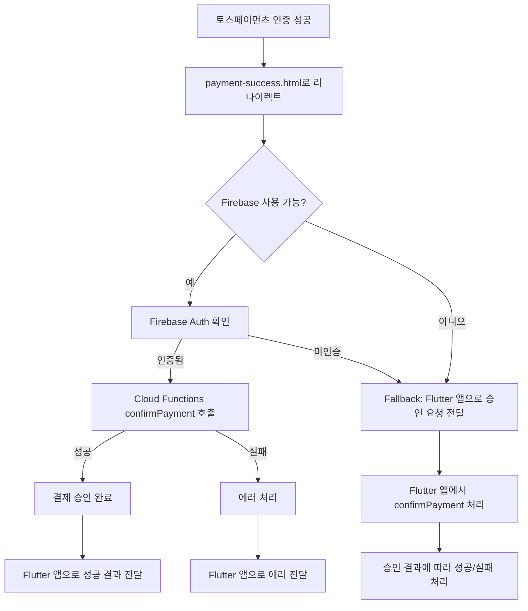

# 웹 환경 토스페이먼츠 결제 플로우 수정 완료

## 📋 문제 해결 요약

### 🚨 기존 문제점
- 웹 환경에서 QR코드로 토스 모바일 앱에서 결제 완료
- 하지만 토스페이먼츠 API 로그에서 확인되지 않음
- **핵심 원인**: `payment-success.html`에서 결제 승인 API(confirmPayment) 호출 누락

### ✅ 해결 방법
토스페이먼츠 v1 문서에 따른 **요청 → 인증 → 승인** 3단계 흐름 완성:
1. `payment-success.html`에서 Firebase Cloud Functions의 `confirmPayment` 호출
2. 승인 성공 시 Flutter 앱으로 결과 전달
3. Fallback 메커니즘으로 안정성 확보

## 🔄 수정된 결제 플로우

### 1. 결제 요청


### 2. 결제 인증 성공 (핵심 수정사항)


### 3. 메시지 타입
| 타입 | 설명 | 처리 방법 |
|------|------|-----------|
| `payment_confirmed` | 이미 승인된 결제 | 바로 성공 화면 이동 |
| `payment_needs_confirmation` | 승인 필요한 결제 | Flutter에서 confirmPayment 호출 |
| `payment_error` | 결제 오류 | 에러 화면 표시 |

## 🛠 주요 수정 파일

### 1. `web/payment-success.html`
**🆕 추가된 기능:**
- Firebase SDK 통합
- 결제 승인 API 직접 호출
- Fallback 메커니즘
- 상세한 에러 처리

```javascript
// 핵심 로직
async function confirmPayment(paymentData) {
    try {
        const confirmPaymentFunction = httpsCallable(functions, 'confirmPayment');
        const result = await confirmPaymentFunction({
            paymentKey: paymentData.paymentKey,
            orderId: paymentData.orderId,
            amount: parseInt(paymentData.amount)
        });
        
        // 성공 시 Flutter 앱으로 전달
        sendSuccessToFlutter({
            ...paymentData,
            confirmed: true,
            confirmationData: result.data
        });
    } catch (error) {
        // 에러 시 Flutter 앱으로 전달
        sendErrorToFlutter({
            ...paymentData,
            error: error.message
        });
    }
}
```

### 2. `web/firebase-config.json`
**🆕 신규 파일:** Firebase 웹 설정

### 3. `lib/features/order/screens/payment_screen.dart`
**🆕 추가된 기능:**
- 새로운 메시지 타입 처리
- 웹 환경 URL 파라미터 파싱
- 승인 완료된 결제 직접 성공 화면 이동

```dart
void _handleWebPaymentMessage(Map<String, dynamic> data) {
    final messageType = data['type'] as String?;
    
    switch (messageType) {
        case 'payment_confirmed':
            _navigateToSuccessScreen(paymentKey, orderId, amount);
            break;
        case 'payment_needs_confirmation':
            _showPaymentSuccess(paymentKey, orderId, amount);
            break;
        case 'payment_error':
            _showPaymentFailure('WEB_PAYMENT_ERROR', error);
            break;
    }
}
```

## 🔒 보안 및 안정성

### 1. Firebase Cloud Functions 활용
- 시크릿 키 서버 환경에서만 관리
- 사용자 인증 확인
- 결제 승인 API 안전한 호출

### 2. Fallback 메커니즘
- Firebase 초기화 실패 시 대응
- 사용자 미인증 시 대응
- 네트워크 오류 시 대응

### 3. 10분 제한 시간 준수
- successUrl 리다이렉트 후 즉시 승인 API 호출
- 토스페이먼츠 정책 준수

## 🧪 테스트 시나리오

### 1. 정상 플로우
1. 웹에서 결제 요청
2. QR코드로 토스 모바일 앱 결제
3. payment-success.html에서 자동 승인
4. Flutter 앱 성공 화면 이동

### 2. Fallback 플로우
1. Firebase 사용 불가 상황
2. Flutter 앱에서 승인 처리
3. 결과에 따른 화면 이동

### 3. 에러 처리
1. 승인 API 호출 실패
2. 에러 정보 Flutter 앱 전달
3. 사용자에게 적절한 안내

## 📝 추후 개선사항

1. **웹훅 연동**: 결제 상태 변경 실시간 알림
2. **재시도 로직**: 네트워크 오류 시 자동 재시도
3. **로깅 강화**: 결제 과정 상세 로그
4. **사용자 경험**: 로딩 상태 및 진행률 표시

## 🔗 관련 문서

- [토스페이먼츠 v1 리다이렉트 URL 가이드](https://docs.tosspayments.com/blog/redirect)
- [Firebase Cloud Functions 가이드](https://firebase.google.com/docs/functions)
- [현재 웹 결제 플로우](./CURRENT_WEB_PAYMENT_FLOW.md)

---
**수정 완료일**: 2024년 현재  
**수정자**: AI Assistant  
**검증**: 토스페이먼츠 v1 문서 기반 